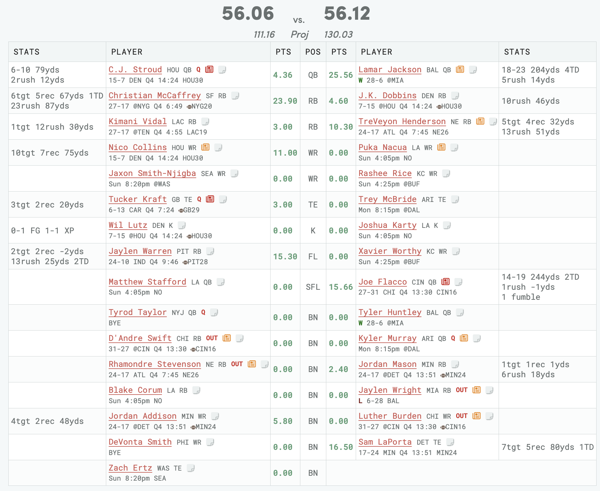
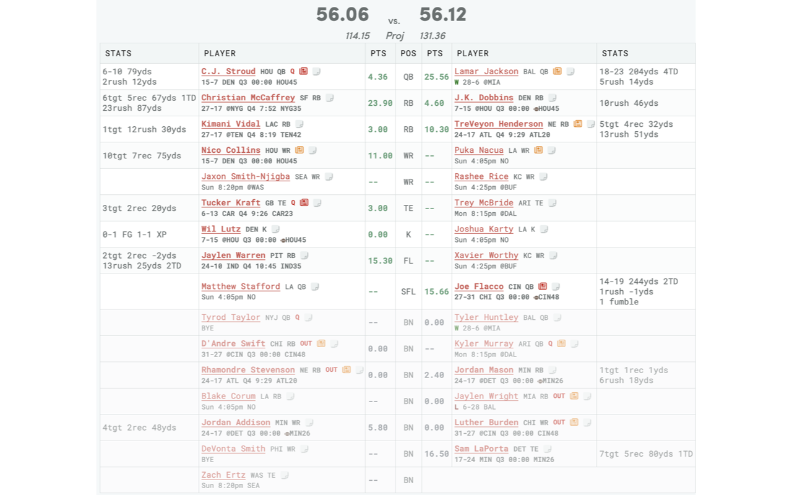

# Ottoneu Viewer Extension

A Chrome extension that enhances the Ottoneu fantasy football experience by providing improved visual formatting for game data.

### Before


### After


### How It Works

Determines the status of each player's game and adds classes with custom CSS to more easily differentiate players who have not yet played, are currently playing, have finished their games, or are on the bench.

## Development

### Prerequisites
- Node.js 16 or later
- npm

### Setup
1. Clone this repository
2. Install dependencies:
   ```bash
   npm install
   ```

### Building
- **Development build with watch mode:**
  ```bash
  npm run dev
  ```

- **One-time build (compiles TS only, doesn't touch CSS or icons):**
  ```bash
  npm run build
  ```

- **Compile and prepare icons/CSS for distribution:**
  ```bash
  npm run prepare
  ```

- **Create distribution package for Chrome Web Store:**
  ```bash
  npm run distribute
  ```
  This builds the extension and creates a ZIP file ready for Chrome Web Store submission.

The built extension will be in the `dist/` folder.

## Installation

1. Build the extension (see Development section above)
2. Open Chrome and go to `chrome://extensions/`
3. Enable "Developer mode" in the top right
4. Click "Load unpacked" and select the `dist/` folder
5. The extension will automatically activate on Ottoneu pages

## Usage

The extension works automatically on Ottoneu fantasy football pages. Simply:

1. Navigate to any Ottoneu game page with player matchups
2. The extension will automatically apply formatting based on game states
3. Formatting updates when page content changes
